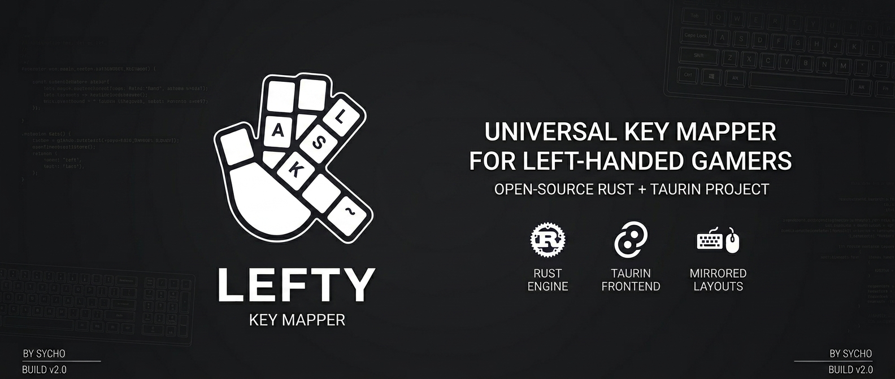
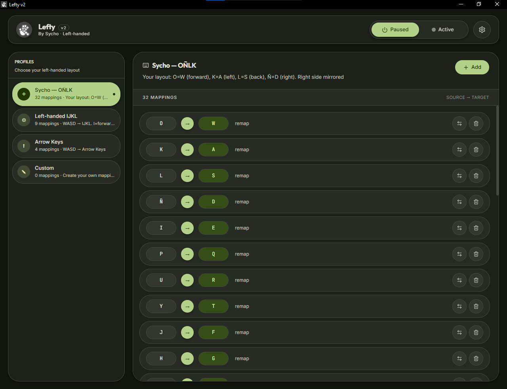
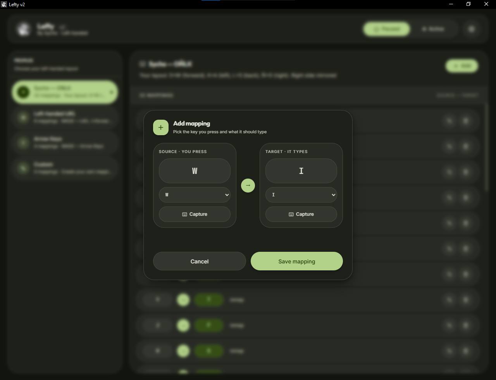
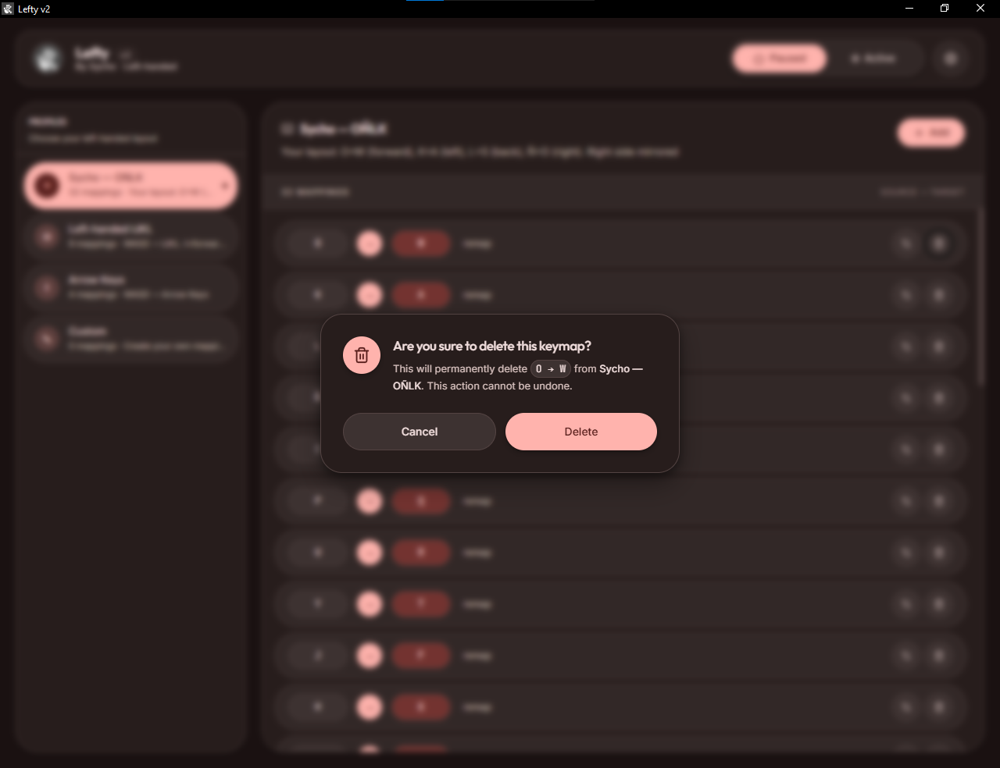
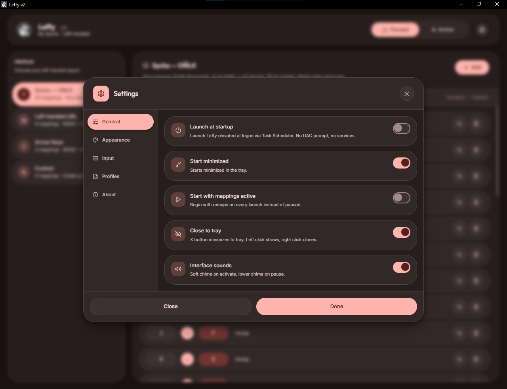
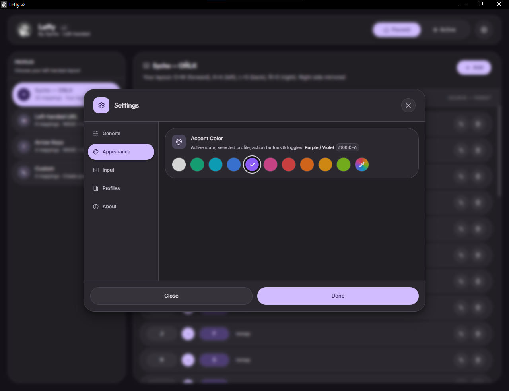
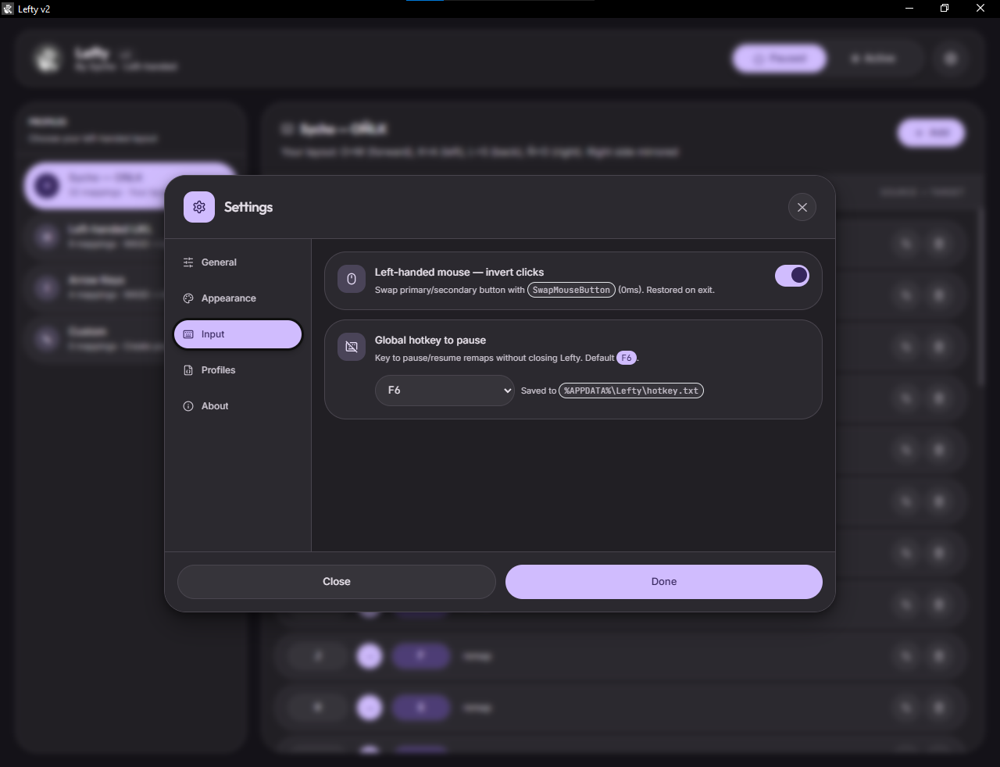
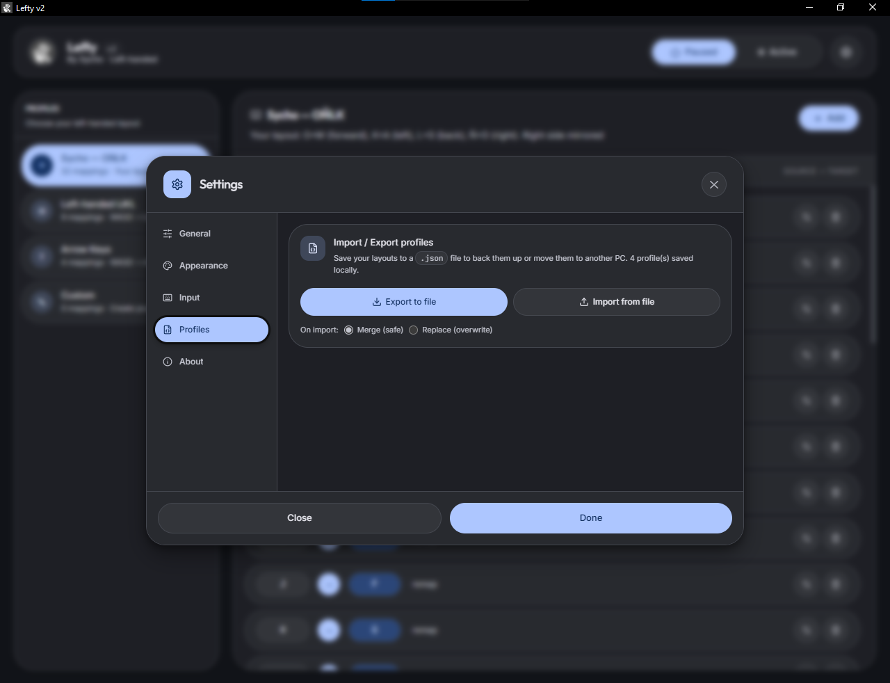
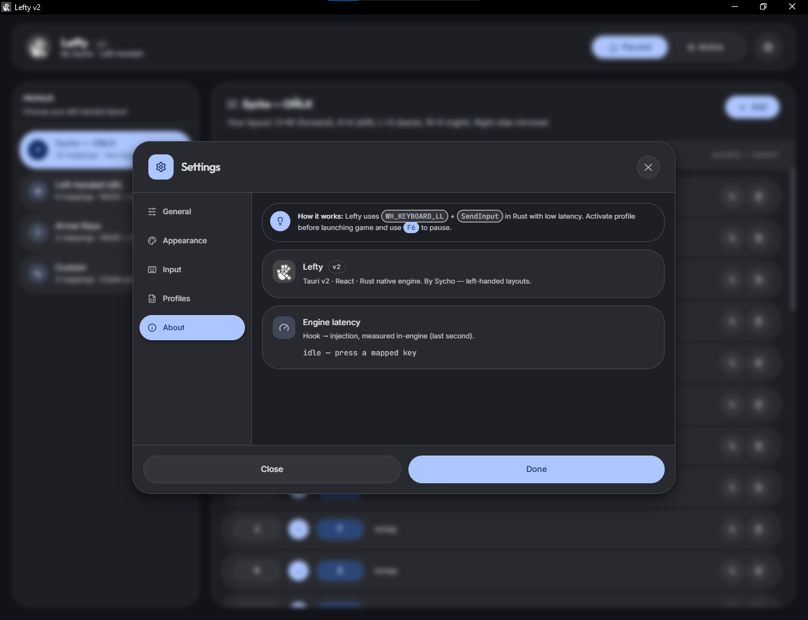

# Lefty

Remap any key for left-handed gaming. Low latency, native Rust engine.


## What is it?

- **WASD → IJKL** (or arrows, numpad) for left-hand movement
- Map any key to any other: `W→I`, `Q→U`, `Caps→Ctrl`, `Win→Disabled`
- Add-mapping validation: duplicate sources and self-maps are blocked inline
- Accent Color themes: 10 presets + custom picker (Settings → Appearance)
- Profile Import/Export to `.json` with merge or replace modes
- Interface sounds: distinct chimes for activate vs pause (Settings → General)
- Tabbed Settings: General, Appearance, Input, Profiles, About
- Works in any game (low-level hook)
- Very low latency native Rust engine (verify live in Settings → About)
- Clean dark UI

## Screenshots

### Main window



### Mappings

| Add mapping | Delete mapping |
|---|---|
|  |  |

### Settings

| General | Appearance |
|---|---|
|  |  |

| Input | Profiles |
|---|---|
|  |  |



## Install

```bash
git clone https://github.com/EtherealDevv/Lefty
cd Lefty
# Run
.\dist\Lefty.exe
# Or install
.\dist\Lefty_1.3.0_x64-setup.exe
```

> Run as **Administrator** for games that run elevated.

## Profiles

| Profile | Mapping |
|---------|---------|
| **Sycho — OÑLK** | `O→W, K→A, L→S, Ñ→D` + mirrored |
| **Left-handed IJKL** | `W→I, A→J, S→K, D→L` |
| **Arrow Keys** | `W→UP, A→LEFT...` |
| **Custom** | Empty, make your own |
| **Disabled** | No remap |

## Usage

1. Pick a profile on the left
2. **Add** or **Capture** a mapping (`W` → `I`, duplicates rejected)
3. **Activate**
4. Play (activate before launching the game)
5. **Pause** to restore, `F6` to toggle, close to tray
6. Back up via Settings → Profiles → Export, restore via Import

## Latency

| Method | Latency |
|--------|---------|
| Registry | 0ms (reboot, not dynamic) |
| **Lefty** | **low latency*** |

*Verify it yourself live in the app: Settings → About → Engine latency.
| AutoHotkey | 5-15ms |

## Structure

```
Lefty/
├── core/       # keys, profiles
├── engine/     # remapper (Rust + Python fallback)
├── engine_native/ # Rust engine
├── tauri-app/  # Rust + React UI
└── dist/       # Lefty.exe + installers
```

## Troubleshooting

- **Not working in game**: Run as **Admin**. Some anti-cheats block hooks → use Interception.
- **Stuck key**: Pause and resume.
- **High delay**: Close other hooks (AutoHotkey).

## Acknowledgments

- Remapping architecture inspired by [Microsoft PowerToys Keyboard Manager](https://github.com/microsoft/PowerToys) (low-level hook + `SendInput` design, Task Scheduler autostart pattern) — reimplemented from scratch in Rust with a zero-GC hot path, batched injection and live latency telemetry for lower, measurable latency.

## License

MIT — Made for left-handed gamers.
